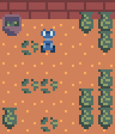

Welcome to the first lab for
  [AI Safety and Alignment](https://robots.ox.ac.uk/~fazl/aisaa/),
MT 2025.

Structure of today's lab:

0. Installation---in which we install dependencies and introduce JAX.
1. Agents and environments---in which we introduce two core elements of the
   elements of reinforcement learning framework and explore a simple grid-world
   environment.
2. Reward functions---in which we introduce the third element of reinforcement
   learning, and train an agent in our simple environment.
3. Specification gaming---in which we explore the consequences of failing to
   account for 'creative' ways of optimising our reward function.
4. Generalisation---in which we train in a distribution of environments in the
   hope that the agent will learn to behave correctly in situations it has
   never seen.
5. Goal misgeneralisation---in which we explore the consequences of failing to
   account for ambiguity in the specification of our goals.

The supporting code for today's lab can be found at
  [github.com/matomatical/reward-lab](https://github.com/matomatical/reward-lab).

Make sure to ask your TAs for help if you get stuck.

Part 0: Installation
====================

Choosing a runtime
------------------

For parts 1--3, the default CPU runtime is sufficient. When you reach parts 4
and 5, it makes sense to switch over to a GPU (fast) or TPU (fastest) and
repeat the installation and imports.

Configuring the runtime
-----------------------

Install custom code and dependencies.
```python
!git clone https://github.com/matomatical/reward-lab.git /content/reward-lab/ || git -C /content/reward-lab pull
%cd /content/reward-lab
!pip install --quiet -r requirements.txt
!pip install --quiet -r requirements-notebook.txt
```

Allow custom widgets in Colab.

```python
from google.colab import output
output.enable_custom_widget_manager()
```

Import dependencies.
```python
import functools
import numpy as np
import jax
import jax.numpy as jnp
import einops
import optax
import tqdm.notebook
import matplotlib.pyplot as plt
from jaxtyping import Array, Float, Bool, PRNGKeyArray
```

Import classes and functions for this lab
(see [github.com/matomatical/reward-lab](https://github.com/matomatical/reward-lab) for source).
```python
import strux
from util import display_rollout, display_rollouts, InteractivePlayer, LiveSubplots, display_envs
from potteryshop import Item, State, Action, Environment, collect_rollout
from evaluation import RewardFunction, compute_return, evaluate_behaviour
from agent import ActorCriticNetwork

# a constant
DISCOUNT_RATE = 0.995
```

Hello, JAX!
-----------

This workshop uses [JAX](https://jax.readthedocs.io/), a Python deep learning
framework that is a modern alternative to PyTorch and TensorFlow. Much modern
reinforcement learning research, especially at Oxford, takes place in JAX,
making it worth learning. However, today's activities don't require much
familiarity with JAX. For our purposes, note the following:

* JAX programs operate on JAX arrays, which are basically immutable NumPy
  arrays. With a few exceptions, where you would write
    `np.function(numpy_array)` or `numpy_array.method()`,
  you can instead write
    `jnp.function(jax_array)` or `jax_array.method()`.

* Due to immutability, JAX has a slightly more verbose way of managing random
  state compared to other frameworks. It is generally necessary to pass around
  a `key` object corresponding to a node in a tree of random states, and to
  manually advance the state.

* One cool feature of JAX is that, once you write a function with JAX arrays,
  you can use `jax.vmap(function)` to get a version that works with arrays that
  have extra batch dimensions. This means we normally don't have to worry about
  managing batch dimensions ourselves at all. We'll see `jax.vmap` a couple of
  times throughout the code in this notebook.

* Another cool feature of JAX is that, once you write a function with JAX
  arrays, you can use `jax.jit(function)` to get a version that is just-in-time
  compiled and optimised to run efficiently on your specific CPU, GPU, or TPU.
  The resulting speed boost is one of the main selling points of JAX. We will
  see `jax.jit` in action today, giving us faster feedback loops than if we had
  written the notebook using PyTorch.

* JAX's powerful function transformations like `jax.jit` and `jax.vmap` come at
  a cost. In order for functions to be easily batchable and to run well on GPUs
  and TPUs, the computational graph of each function needs to be made "uniform"
  in that the shapes and operations involved don't depend on the values in the
  input arrays. For example:

  * We can't use `if` statements that depend on array values.
  * We can't use `while` loops whose termination condition depends on array
    values.
  * We can use `for` loops with fixed numbers of iterations, but they are
    unrolled in the computational graph causing long compile times.
  * We can't use some NumPy operations, such as boolean indexing, that result
    in arrays whose shapes depend on the values of other arrays.

  JAX provides its own primitives and patterns for getting around these issues
  and writing the kind of expressive Python programs we are used to.

Throughout this notebook, there are examples and hints on the necessary JAX
knowledge to get you through what limited use of JAX we need for the exercises,
and you can always ask your tutors or an LLM for help if you are facing a weird
JAX error.

After today, if you are interested in learning more about JAX,
  [see](https://github.com/n2cholas/awesome-jax)
  [these](https://far.in.net/hijax)
  [resources](https://uvadlc-notebooks.readthedocs.io/en/latest/tutorial_notebooks/JAX/tutorial2/Introduction_to_JAX.html).


Part 1: Agents and environments
===============================

In reinforcement learning (RL), we model a sequential decision-making task with
two main entities:

1. An **environment,** which models the state of the world, keeping track of
   how the world changes in response to the actions of an agent (speaking of
   which...)
2. An **agent,** who repeatedly receives information about the current state of
   the environment, chooses an action, and executes that action in the
   environment.

In this part, we'll familiarise ourselves with these concepts.

Note: The framework of reinforcement learning would not be complete without
discussing a third entity, the **reward function.** We'll come to reward
functions in part 2.

Markov decision process formalism
---------------------------------

A popular formalism for defining environments is that of the **Markov decision
process (MDP).** A (rewardless) MDP is a tuple
  $(S, A, \iota, \tau)$
where:

* $S$ is a set of environment states,
* $A$ is the set of actions available to the agent from any state,
* $\iota \in \Delta(S)$ is a distribution of initial states (the states the
  environment starts in before the agent takes any actions), and
* $\tau : S \times A \to \Delta(S)$ is a conditional transition distribution:
  given the current state $s$ and agent action $a$, $\tau(s,a)$ gives the
  probability for the environment to transition into each possible next state.

(Note: This definition omits the reward function and discount factor usually
included in the definition of an MDP. We'll return to defining those in the
next part.)

The Markov decision process earns its name from the fact that the transitions
as defined here satisfy a Markov property, whereby they are independent of the
path taken to get to the state before the transition.

An environment represented by an MDP is often paired with an agent represented
by an action-selection **policy** of the form
  $$
    \pi : S \to \Delta(A),
  $$
where $\pi(s)$ represents the probability that the agent will take each
possible action given the state $s$.
Sometimes, the policy is defined to take as input only a certain subset of
state information (called an *observation*), or perhaps a sequence of
states (or observations), having the effect of imbuing the agent with a memory.

Pottery shop: A simple environment
----------------------------------

Here is a picture of an environment called "pottery shop".



Pottery shop is an example of a grid-world environment, where everything plays
out on a finite grid of positions (in this case, a 6 by 6 grid).

This grid world contains various objects:

* Urns---the products of the pottery shop.
* Shards---some urns have been broken, leaving behind piles of shards.
* A bin---there is a bin in the corner that stores shards.
* A robot---there is a small blue robot who can move around the grid, pick up
  shards, carry them around, and drop them (e.g., into the bin).
  If the robot crashes into one of the urns, the urn will break, creating a new
  pile of shards.

The pottery shop environment is implemented in the source file
`environment.py`. Some relevant snippets of code are as follows.

### Environment layout

Pottery shop actually refers to a family of environments of different sizes and
with different initial configurations of objects. We represent such an
environment as an `Environment` dataclass as follows:

```python
@strux.struct
class Environment:
    init_robot_pos: UInt8[Array, "2"]
    init_items_map: UInt8[Array, "world_size world_size"]
    bin_pos: UInt8[Array, "2"]
```

In particular, the fields are as follows:

* `init_robot_pos` contains the row and column grid coordinates of the spawn
  position of the robot.
* `bin_pos` similarly contains the row and column grid coordinates of the spawn
  position of the bin.
* `init_items_map` is an N by N array where N is the size of the grid world.
  The contents of the array map to the presence of shards or urns in the
  respective grid squares.

The following enumeration type explains how to interpret the numbers in
`init_items_map`.

```python
class Item(enum.IntEnum):
    EMPTY = 0
    SHARDS = 1
    URN = 2
```

The coordinates in `init_robot_pos` and `bin_pos` should range from `0` to
`world_size-1`, and the values in `init_items_map` should all be `0`, `1`, or
`2`.

> ### `jaxtyping`
> 
> This code snippet uses type annotations of the form `UInt8[Array, "shape"]`.
> `UInt8` and `Array` were imported from `jaxtyping` above (along with some
> other array types, namely `Float` and `Bool`). These type annotations
> describe the intended type and shape of the JAX arrays used in this code:
> 
> * `init_robot_pos` and `bin_pos` are JAX arrays of unsigned 8-bit integers
>   with shape `(2,)`.
> * `init_items_map` is a JAX array of unsigned 8-bit integers with shape
>   `(world_size, world_size)`.
> 
> Some other examples:
> 
> * `Float[Array, "height width 3"]` indicates an array of floats with shape
>   `(height, width, 3)`, for example for representing some RGB image data.
> * `Bool[Array, ""]` indicates a zero-dimensional array of booleans, that is,
>   a boolean scalar.
> 
> These annotations are not currently type checked, and should be treated like
> comments (in particular, they may contain typos). Nevertheless, we hope they
> array-manipulating code easier to follow. Feel free to include these
> annotations in your own code, too.

> ### `@strux.struct`
> 
> This code snippet uses the `strux.struct` wrapper, defined in `strux.py`.
> Basically, this is equivalent to the built-in Python wrapper
> `dataclasses.dataclass(frozen=True)`, but with some extra functionality to
> make the dataclasses integrate nicely with JAX function transformations.


### Environment state

The environment object encodes the initial configuration of the pottery shop.
But once we start taking actions, the state will change. At any time, the
current state of the grid world is represented by the following dataclass.

```python
@strux.struct
class State:
    robot_pos: UInt8[Array, "2"]
    bin_pos: UInt8[Array, "2"]
    items_map: UInt8[Array, "world_size world_size"]
    inventory: UInt8[Array, ""]
```

The fields `robot_pos`, `bin_pos`, and `items_map` are the dynamic versions of
`init_robot_pos`, `bin_pos`, and `init_items_map` from the environment
configuration.

What's new is `inventory`, an integer scalar that represents what kind of item
the robot is carrying. This is initially `Item.EMPTY`, but changes to
`Item.SHARDS` if the robot picks up a pile of shards (and changes back to
`Item.EMPTY` if the robot drops the shards).

### Agent actions

The agent is responsible for controlling the robot as it moves around the grid.
In each interaction, the agent sees the current state, and then chooses what
the robot should do from the following options.

```python
class Action(enum.IntEnum):
    WAIT = 0 # do nothing
    UP = 1 # move up
    LEFT = 2 # move left
    DOWN = 3 # move down
    RIGHT = 4 # move right
    PICKUP = 5 # pick up item
    PUTDOWN = 6 # drop held item
```

### Environment methods
    
So much for defining the data types involved, the actual implementation of the
environment logic takes place inside the methods of the environment class.
The two most important methods are the following:

* `def reset(self: Environment) -> State`: Initialises a `State`.

* `def step(self: Environment, state: State, action: Action) -> State`: Takes
  the current state and the agent's actions and returns the resulting state of
  the environment (for example, moving the robot, updating its inventory,
  smashing urns).

Task 1: Explore pottery shop
----------------------------

Your first task is simply to instantiate and explore a pottery shop
environment. Complete the following sub-tasks:

1. Create an `Environment` object, including a world size of at least 4, at
   least one pile of shards, and at least one urn.

2. Interact with the environment using the built-in simulator
  `InteractivePlayer`.

  
Note: Sub-task 1 involves specifying JAX arrays for each of the arguments of
the `Environment` constructor. To create a JAX array, you can use
`jnp.array(...)` where the input is a list, a nested list, or a numpy array.
Other numpy-like methods for creating arrays should work as well, such as
`jnp.zeros`, `jnp.ones`, `jnp.arange` etc.).

```python
env = # ...
```

```python
InteractivePlayer(env)
```

Task 1 solution
---------------

Of course, many environment layouts are permissible. Here is the one depicted
above:

```python
env = Environment(
    init_robot_pos=jnp.array((1,2), dtype=jnp.uint8),
    init_items_map=jnp.array((
      (0,0,0,0,2,2),
      (0,1,0,0,0,2),
      (0,0,0,0,0,0),
      (0,1,1,0,0,2),
      (0,0,0,0,2,2),
      (2,0,1,0,2,2),
    ), dtype=jnp.uint8),
    bin_pos=jnp.array((0,0), dtype=jnp.uint8),
)
```

Bonus task: Framing questions
-----------------------------

If you have time and interest, consider the following questions:

1. Could you write down the pottery shop environment in the MDP formalism? How
   would this compare to the Python implementation? What definitions or methods
   correspond to the set of states, the set of actions, the initial state
   distribution, and the transition distribution?

2. Consider the joint system of you and your computer, while you are clicking
   the buttons that control the pottery shop robot. Decompose this system into
   an environment and an agent. What are the states, and what are the actions?

3. Is the division between agent and environment that you came up with for the
   previous question unique? Are there other ways you could divide up the
   system into an environment and an agent? How many can you think of?

4. When you interacted with the environment, were you acting out a memoryless
   policy, or would representing your policy require histories of environment
   states as inputs? Does it depend on where you draw the boundary between the
   agent and the environment?

Part 2: Reward functions
========================

We now return to our description of the reinforcement learning framework.

Reward functions
----------------

Once we have an environment with a set of states $S$ and an agent with a set of
actions $A$, a **reward function** is defined as a function
$$
  r : S \times A \times S \to \mathbb{R}
$$
that maps individual interactions between the environment and the agent to
scalar reward values.

Note that here the input triple $(s,a,s') \in S \times A \times S$ represents
an environment state ($s$), the agent's choice of action ($a \sim \pi(s)$), and
the resulting successor state ($s' \sim \tau(s,a)$).
Sometimes reward functions are defined on states alone ($r: S \to \mathbb{R}$),
state-action pairs ($r:S \times A \to \mathbb{R}$), or state pairs ($r : S
\times S \to \mathbb{R}$), but the most general form includes the above three
elements.

Maximising expected return
--------------------------

Given a reward function and a **trajectory** of states and actions,
$$
  s_0, a_0, s_1, a_1, \ldots
$$
we define the **return** $R$ as the discounted cumulative sum of rewards:
$$
  R(s_0, a_0, \ldots) = \sum_{t=0}^{\infty} \gamma^t r(s_t, a_t, s_{t+1})
$$
where $\gamma \in (0,1)$ is a discount factor that controls how much more to
value rewards received earlier versus later in time.

A typical formulation of the goal of reinforcement learning algorithms is,
given an environment, a reward function, and a discount factor, find a policy
that **maximises expected return** (taking the expectation over the
stochasticity in the initial state distribution, the transition distribution,
and the policy itself).

The reward hypothesis 
---------------------

Reward functions play a central role in the discipline of reinforcement
learning. Their centrality is driven by the following hypothesis, called the
**reward hypothesis:**

> That all of what we mean by goals and purposes can be well thought of as
> maximization of the expected value of the cumulative sum of a received scalar
> signal (reward).
> 
> ---Richard Sutton, [The reward hypothesis](http://incompleteideas.net/rlai.cs.ualberta.ca/RLAI/rewardhypothesis.html)

The reward hypothesis essentially claims that, regardless of what kind of
purposes we want a system to fulfil, we can sensibly formulate that behaviour
as the maximum expected return for *some* reward function. Once we find the
right reward function, then we just need to apply a reinforcement learning
algorithm to find a policy with the behaviour we desire.

While there is some debate in the field as to the extent to which the reward
hypothesis is true in its maximal form (that maximisation of scalar returns
covers *all* goals and purposes), it is certainly true that:

* There are some AI problems where finding the right reward function has
  allowed us to specify behaviours that were infeasible to specify imperatively
  (e.g. by programming, as in classical software engineering) or even
  declaratively (e.g. by generating labelled examples, as in supervised
  learning), with the most notable example being computer Go playing and recent
  examples of frontier reasoning models.

* This possibility has driven a substantial portion of interest in the field of
  reinforcement learning, with some seeing reinforcement learning as a key
  component of the likely path to human-level and super-human AI in the future.

Of course, it remains to find the right reward function!

Task 2: Interpreting a reward function
--------------------------------------

Your second task is to study a reward function and consider the behaviour it
incentivises. Here is the reward function:

```python
def reward1(state: State, action: Action, next_state: State) -> float:
    item_below_robot = state.items_map[
        state.robot_pos[0],
        state.robot_pos[1],
    ]
    pickup_reward = (
        (item_below_robot == Item.SHARDS)
        & (state.inventory == Item.EMPTY)
        & (action == Action.PICKUP)
    ).astype(float)
    dispose_reward = (
        (state.bin_pos[0] == state.robot_pos[0])
        & (state.bin_pos[1] == state.robot_pos[1])
        & (state.inventory == Item.SHARDS)
        & (action == Action.PUTDOWN)
    ).astype(float)
    total_reward = pickup_reward + dispose_reward
    return total_reward
```

Note that `&` represents elementwise 'and' for (NumPy or) JAX arrays.

Your task is to answer the following questions:

1. Describe the kinds of transitions for which this reward function returns
   `1.0` vs `0.0`.

2. What kinds of qualitative behaviours do you think a reward designer who came
   up with this reward function is trying to incentivise?

3. What kinds of qualitative behaviours maximise return subject to this reward
   function? Are they the same as the previous answer?

Task 2 solution
---------------

Answers to questions:

1. The reward function assigns reward 1 to transitions in which the robot picks
   up a pile of shards, and transitions in which it drops a pile of shards
   into the bin.

2. The reward designer is probably trying to incentivise the agent to operate
   the robot to pick up shards and put them into the bin, 'cleaning up' the
   pottery shop.

3. See below...

Cleaning up shop
----------------

Next, let's apply a reinforcement learning algorithm to see what behaviours the
agent learns given this reward function.

We'll need a neural network parametrisation of a policy we can train by
gradient descent. The following code defines a small CNN-based policy network.

```python
key = jax.random.key(seed=42)
key_init, key = jax.random.split(key)
net = ActorCriticNetwork.init(
    key=key_init,
    obs_height=env.world_size,
    obs_width=env.world_size,
    obs_features=2,
    net_channels=16,
    net_width=32,
    num_conv_layers=2,
    num_dense_layers=1,
    num_actions=len(Action),
)
```

The library `ppo.py` provides a function `ppo_train_step` that collects some
rollouts and trains an agent network on these using a reinforcement learning
algorithm (proximal policy optimisation). Here is a function that wraps this
into a training loop:

```python
def train_agent(
    key: PRNGKeyArray,
    env: Environment,
    net: ActorCriticNetwork,
    reward_fn: RewardFunction,
    num_train_steps: int = 512,
    num_train_steps_per_vis: int = 8,
) -> ActorCriticNetwork:
    learning_rate = 0.001
    max_grad_norm = 0.5
    optimiser = optax.chain(
        optax.clip_by_global_norm(max_grad_norm),
        optax.adam(learning_rate=learning_rate),
    )
    optimiser_state = optimiser.init(net)

    liveplot = LiveSubplots(['return'], num_train_steps)
    for t in tqdm.notebook.trange(num_train_steps):
        key_step, key = jax.random.split(key)
        net, optimiser_state, metrics = ppo_train_step(
            key=key_step,
            net=net,
            env=env,
            reward_fn=reward_fn,
            optimiser=optimiser,
            optimiser_state=optimiser_state,
            # ppo step hyperparameters
            num_rollouts=32,
            num_env_steps=64,
            discount_rate=DISCOUNT_RATE,
            eligibility_rate=0.95,
            proximity_eps=0.1,
            critic_coeff=0.5,
            entropy_coeff=0.001,
        )
        liveplot.log(t, {'return': metrics['return']})
        if (t+1) % num_train_steps_per_vis == 0:
            liveplot.refresh()
    
    return net
```

Let's call that function on the initialised policy network, your
manually-instantiated environment from task 1, and the above reward function,
to train the policy for a small number of steps.

```python
key_train, key = jax.random.split(key)
net1 = train_agent(
    key=key_train,
    net=net1,
    env=env,
    reward_fn=reward1,
    num_train_steps=512,
)
```

> ### `jax.random.key` and `jax.random.split`
> 
> The above code is our first use of JAX's quirky PRNG state management
> pattern.
> 
> In other frameworks, the first step to drawing reproducible random samples
> would be to initialise a PRNG object, to be passed into each random function.
> Each of these functions would draw samples from the PRNG whenever needed,
> mutating the internal state of the PRNG so that every additional sample is
> independent.
> 
> Mutability complicates the kinds of function transformations JAX specialises
> in. So in JAX, we need a way to manage a PRNG's state without mutating an
> object. The JAX solution is essentially for the user to explicitly create a
> copy of the PRNG (with a modified state) and pass different parts of the
> state around to each function. Actually, instead of advancing the state
> linearly, it's more accurate to say that we *split* the state into multiple
> independent child states. Each function gets its own independent branch of
> the phylogenetic tree of PRNG states, which it can continue to split and pass
> around to its liking.
> 
> We see this in the above examples. First, `key = jax.random.key(seed=42)`
> initialises a root random state. Then,
>   `key_init, key = jax.random.split(key)`
> forks it into two children:
> 
> * `key_init`---a branch for passing into the network initialisation function.
> * `key` (again)---since we don't need the root state after we have split it,
>   it is idiomatic to reassign one of the children to the old variable if we
>   want to split again later in the current scope.
> 
> In the next cell, we repeat this pattern, sending `key_train` into the
> training function, and reassigning `key` to a fresh child for subsequent use.
> 
> One thing to watch out for when using JAX in notebooks is that the JAX idiom
> of reassigning to `key` and the notebook idiom of repeated execution of cells
> do not mix well. If you re-run the previous code block, you will get
> different training calls each time as `key` is reassigned to the output of
> the split inside the block. This is fine for today, but for robust
> reproducibility, one should either use fresh names for each child key or have
> each cell restart from its own seed.

Task 3: Interpreting an agent's behaviour
-----------------------------------------

The next task is to study the behaviour of the agent we learned, and see to
what extent it matches the behaviour we intended or expected when we designed
this reward function. The following code samples and animates some trajectories
from the learned network. Your task is to run the code and study the policies,
discerning if there are any difference between:

1. The behaviour the designer of the reward function likely intended;
2. The behaviour you expected after studying the reward function; and
3. The actual behaviour observed.

```python
key_rollout = jax.random.key(seed=1)
rollout = collect_rollout(
    env=env,
    key=key_rollout,
    policy_fn=net1.policy,
    num_steps=64,
)
display_rollout(rollout)
```

Note: Change the seed above to see trajectories with different random results when
sampling actions from the policy.

Questions:

1. What qualitative behaviours do you observe?

2. Are there discrepancies between the behaviour you observe and the
   intended/expected behaviour? If so, list them.

Task 3 solution
---------------

See below...

Part 3: Specification gaming
============================

\begin{center}
\color{red}\bf
Note: Finish task 3 before reading further.
\end{center}

If all has gone to plan, you should be looking at an example of specification
gaming (also known as reward hacking), in which the reinforcement learning
algorithm found a better way to increase expected return than the class of
valid solutions the reward designer had in mind.

The two kinds of discrepancies we expect to see in this example are:

1. The agent prefers to repeatedly pick up and drop shards compared to picking
   them up once and taking them to the bin; and
2. The agent is willing to break urns to find new shards to pick up.

In this part, we will redesign the reward function to prevent these unintended
behaviours from being incentivised.

The inverse reward hypothesis
-----------------------------

Recall the reward hypothesis from above. While this hypothesis is usually
invoked in the context of designing an agent using reinforcement learning by
identifying an appropriate reward, it applies more broadly as stated.

In particular, the reward hypothesis applies to the behaviour of existing
agents. Suppose we have a system whose behaviour fulfils some purpose. Then (by
the reward hypothesis), that behaviour can be well thought of as maximising
expected return for *some* reward function.

One could call the above corollary the **inverse reward hypothesis,** following
  [Stuart Russell (1998)](https://dl.acm.org/doi/10.1145/279943.279964), also
  [Andrew Ng and Stuart Russell (2000)](https://dl.acm.org/doi/10.5555/645529.657801),
who introduced the problem of *inverse reinforcement learning* (that of
taking a policy and extracting from it a reward function for which that policy
maximises expected return).

Task 4: Reward functions as behavioural probes
----------------------------------------------

We won't trouble ourselves with inverse reinforcement learning algorithms
today. Instead, let's just take a step in this direction by quantifying the
misbehaviour of our agents using reward functions that incentivise each
problematic behaviour. We won't use these reward functions for training, but we
can use them to measure to what extent we are inadvertently training for these
behaviours---as 'behavioural probes'.

Your next task is to write one reward function that measures the extent to
which an agent is engaging in each problematic behaviour:

1. First, write a reward function `reward_drop` that assigns `+1` every time
   the agent drops a shard (other than in the bin).
2. Second, write a reward function `reward_break` that assigns `+1` every time
   the agent breaks an urn.

```python
def reward_drop(state: State, action: Action, next_state: State) -> float:
   # TODO
```

```python
def reward_break(state: State, action: Action, next_state: State) -> float:
   # TODO
```

Task 4 solution
---------------

There are a couple of ways to implement each of these, since the information
is redundantly represented throughout the state, action, and next state.

Here is a solution for the first function based on checking `state` and
`action`, similar to `reward1`'s `pickup_reward`.

```python
def reward_drop(state: State, action: Action, next_state: State) -> float:
    item_below_robot = state.items_map[
        state.robot_pos[0],
        state.robot_pos[1],
    ]
    return (
        (state.robot_pos != state.bin_pos).any()
        & (item_below_robot == Item.EMPTY)
        & (state.inventory == Item.SHARDS)
        & (action == Action.PUTDOWN)
    ).astype(float)
```

Here is a solution for the second function that checks if shards under the
robot's destination position were originally an urn.

```python
def reward_break(state: State, action: Action, next_state: State) -> float:
    item_below_robot_after_transition = next_state.items_map[
        next_state.robot_pos[0],
        next_state.robot_pos[1],
    ]
    item_there_before_transition = state.items_map[
        next_state.robot_pos[0],
        next_state.robot_pos[1],
    ]
    return (
        (item_below_robot_after_transition == Item.SHARDS)
        & (item_there_before_transition == Item.URN)
    ).astype(float)
```

Quantifying reward hacking
--------------------------

Having written these reward functions, we can get a quantitative signal about
whether our policy is engaging in these misbehaviours. We can collect a batch
of trajectories and then score them according to each reward function and plot
the result, using the following convenience function:

```python
def evaluate_behaviour(
    env: Environment,
    net: ActorCriticNetwork,
    key: PRNGKeyArray,
    reward_fn: RewardFunction,
    num_steps: int = 64,
    num_rollouts: int = 1000,
    discount_rate: float = 0.995,
) -> Float[Array, "num_rollouts"]
```

Note that, unlike a reward function that correctly incentivises the *intended*
behaviour, we ideally want these reward functions *to be minimised.* Moreover,
note that to tell if a reward function is minimised or maximised, we need to
consider the range of possible returns, which depends on the reward function
(in these simple environments it can be derived analytically).

```python
reward_fns = [reward1, reward_drop, reward_break]
return_vecs = [
    evaluate_behaviour(
        key=jax.random.key(seed=1),
        env=env,
        net=net1,
        reward_fn=r,
    )
    for r in reward_fns
]
```

```python
fig, axes = plt.subplots(len(reward_fns), figsize=(5,3*len(reward_fns)))
for (reward_fn, returns, ax) in zip(reward_fns, return_vecs, axes):
    ax.hist(returns)
    ax.set_title(reward_fn.__name__)
    ax.set_xlabel("return")
fig.show()
```


Potential shaping: Avoiding cycles
----------------------------------

Regarding the first problematic behaviour (repeatedly picking up and dropping
shards), one solution would be to remove the reward for picking up shards
altogether. The intention is for the shards to end up in the bin, not in the
inventory for their own sake, anyway.

However, sometimes rewarding instrumental goals can assist the agent's learning
process. When we know that something is instrumentally useful for achieving a
task, it would be nice if we could incorporate that knowledge into the reward.

The only problem is that incorporating these kinds of hints into the reward is
a delicate operation---as we have seen, it can lead to misspecification and
reward hacking if it becomes possible to satisfy the hint without completing
the original task!

Fortunately, there is a sure-fire scheme for adding a so-called **shaping**
term to a reward function without introducing such loops. This is a method
called **potential shaping,** and it works as follows:

1. Formulate the information as a (bounded) function of states, $\Phi : S \to
   \mathbb{R}$, called a potential function.
2. When we transition from state $s$ to state $s'$, add reward $\gamma
   \Phi(s')$ to represent gaining the potential from being in state $s'$, but
   also *subtract* reward $\Phi(s)$ to represent *losing* the potential from
   *leaving* state $s$.
3. This helps the agent learn to steer towards states with 'high potential',
   without giving it a long-term incentive to stay there for the sake of this
   potential---the potential should eventually either be lost (if the agent
   leaves those states without achieving return) or actualised (if the policy
   leaves the states and gains actual reward).

Bonus task: Cancelling potentials
---------------------------------

Those of you who are theoretically inclined may like to try this optional
exercise.

Let
  $\Phi : S \to \mathbb{R}$ be a bounded potential function,
  $r : S \times A \times S \to \mathbb{R}$ a bounded reward function, and
  $\gamma \in (0,1)$ a discount rate.
Define a shaped reward function
  $r' : S \times A \times S \to \mathbb{R}$
such that for all triples $s,a,s'$ we have
$$
  r'(s,a,s') = r(s,a,s') + \gamma\Phi(s') - \Phi(s).
$$

Given a trajectory $s_0, a_0, s_1, a_1, \ldots$, calculate the return under the
two reward functions $r$ and $r'$ and show that they differ by an additive
constant that depends only on $s_0$.

Conclude that ordering on policies induced by the expected return under $r$ is
the same as the ordering on policies induced by the expected return under
$r'$.

Bonus task solution
-------------------

Let $R$ denote the return with respect to reward function $r$, and $R'$ the
return with respect to reward function $r'$. Then:

\begin{align*}
  R'(s_0, a_0, \ldots)
  &= \sum_{t=0}^\infty \gamma^t r'(s_t, a_t, s_{t+1})
\\
  &= \sum_{t=0}^\infty \gamma^t (
      r(s_t, a_t, s_{t+1}) + \gamma\Phi(s_{t+1}) - \Phi(s_t)
  )
\\
  &= \sum_{t=0}^\infty \gamma^t r(s_t, a_t, s_{t+1})
  + \sum_{t=0}^\infty \gamma^{t+1} \Phi(s_{t+1})
  - \sum_{t=0}^\infty \gamma^t \Phi(s_t)
\\
  &= R(s_0, a_0, \ldots)
  + \sum_{t=1}^\infty \gamma^t \Phi(s_t)
  - \sum_{t=0}^\infty \gamma^t \Phi(s_t)
\\
  &= R(s_0, a_0, \ldots) - \Phi(s_0).
\end{align*}

It follows that
\begin{align*}
  \mathbb{E}_{
    s_0 \sim \iota,
    a_t \sim \pi(s_t),
    s_{t+1} \sim \tau(s_t, a_t)
  } \left[
    R'(s_0, a_0, \ldots)
  \right]
  &=
  \mathbb{E}_{
    s_0 \sim \iota,
    a_t \sim \pi(s_t),
    s_{t+1} \sim \tau(s_t, a_t)
  } \left[
    R(s_0, a_0, \ldots) - \Phi(s_0)
  \right]
\\
  &=
  \mathbb{E}_{
    s_0 \sim \iota,
    a_t \sim \pi(s_t),
    s_{t+1} \sim \tau(s_t, a_t)
  } \left[
    R(s_0, a_0, \ldots)
  \right]
  -
  \mathbb{E}_{
    s_0 \sim \iota
  } \left[
    \Phi(s_0)
  \right].
\end{align*}

That is, for all policies $\pi$, the expected return under $r$ and $r'$ differs
by a fixed constant (independent of $\pi$).


Task 5: Implementing potential shaping
--------------------------------------

Using potential shaping, write a reward function `reward_shaped` that still
incentivises the robot to pick up shards but not to put them back down again.
Hint: Consider a potential function that looks at the contents of the
inventory.

```python
def reward_shaped(state: State, action: Action, next_state: State) -> float:
    # TODO
```

Task 5 solution
---------------

The following reward function uses a potential function that is 1 when the
robot is holding a shard and 0 otherwise.

```python
def inventory_potential(state: State) -> float:
    return (state.inventory == Item.SHARDS).astype(float)

def reward_shaped(state: State, action: Action, next_state: State) -> float:
    pickup_shaping_term = (
        DISCOUNT_RATE * inventory_potential(next_state)
        - inventory_potential(state)
    )
    putdown_reward = (
        (state.bin_pos[0] == state.robot_pos[0])
        & (state.bin_pos[1] == state.robot_pos[1])
        & (state.inventory == Item.SHARDS)
        & (action == Action.PUTDOWN)
    ).astype(float)
    return putdown_reward + pickup_shaping_term
```

The effect of shaping is to transform a reward function that only gives reward
when the robot drops a shard into the bin into a reward function that gets this
reward in advance and then loses small amounts of reward while it is holding
the shard until it drops it into the bin, so that after discounting, the total
return after dropping the shard into the bin is equal. If the robot drops the
shard on the floor, it loses the initial reward that was advanced.

Disincentivising specific behaviours
------------------------------------

Let's turn to the second problematic behaviour: breaking urns to find more
shards. There are a couple of different approaches to disincentivising this
behaviour. We'll use a simple approach of directly penalising transitions in
which the robot breaks an urn.

The main question is, how much of a negative reward should we assign for
breaking an urn?

* We need to set the negative reward large enough so that the agent is better
  off *not* breaking the urn rather than breaking the urn and binning the
  resulting shards.
* We can't set the negative reward to be too large, or it will cause training
  instability.

You can try different values, but a good default value would be -2 reward for
breaking an urn. The agent can recover 1 reward later if it bins the shards
created by breaking the urn (the gain in return will be slightly less than 1
due to discounting). Penalising -2 means the agent is clearly better off not
breaking the urn.

Bonus task: Everyone has a price
--------------------------------

If you have time, consider the following two questions:

1. If the reward for breaking an urn is -2, there are still situations in which
   breaking an urn can lead to higher return than not breaking an urn.
   Can you find any such situations?

2. Can you think of any approach to defining a reward function that would make
   breaking urns always suboptimal?

Task 6: Penalty
---------------

Your task is to implement a reward function that assigns a negative reward to
transitions in which the robot breaks an urn. Hint: You already implemented a
related function in task 4.

```
def reward_no_break(state: State, action: Action, next_state: State) -> float:
    # TODO
```

Task 6 solution
---------------

We already implemented a reward function for breaking urns in task 4. Let's
invert this into a reward function for avoiding breaking urns.

```python
def reward_no_break(state: State, action: Action, next_state: State) -> float:
    return -2. * reward_break(state, action, next_state)
```

Task 7: Fixing the specification
--------------------------------

Your next task is to bring together the previous three tasks to eliminate
specification gaming:

1. Combine the rewards from tasks 5 and 6 into a single new reward function,
   `reward2.`

2. Train a new network, using the same environment, agent architecture, and
   hyper-parameters as last time, but this time using the new reward function.

3. Inspect some rollouts, manually and/or by using your evaluation reward
   function probes, to confirm that the agent now behaves as intended.

```python
```

Task 7 solution
---------------

Defining `reward2`:

```python
def reward2(state: State, action: Action, next_state: State) -> float:
    shaped = reward_shaped(state, action, next_state)
    nobreak = reward_no_break(state, action, next_state)
    return shaped + nobreak
```

Training a new agent:
```python
key_train, key = jax.random.split(key)
net2 = train_agent(
    key=key_train,
    net=net,
    env=env,
    reward_fn=reward2,
    num_train_steps=512,
)
```

One can manually inspect its behaviour, or use the tools from task 4.

Part 4: Generalisation
======================

So far, we have worked with a specific grid-world layout. In practice, we want
our agents to be able navigate and complete tasks in the complex environments,
up to and including the real world.

Real-world environments are almost infinitely complex---an agent will almost
never see the same situation more than once. This means we could never hope to
give our agents direct experience in every possible state they might encounter
prior to deployment.

Instead, we need to train agents that will **generalise** from the situations
they encountered during training to the new situations they will face after
deployment.

In this part, we'll investigate a more complex version of our pottery shop
environment where the same agent might face different shop layouts.

Generalisation in RL
--------------------

Generalisation is a foundational concept in machine learning. In reinforcement
learning, generalisation is essentially no different:

* We want a function. In this case, it's a function called a 'policy' and it
  maps from states/observations to action probabilities.

* We use deep learning to learn that function from data. The details here are a
  little different in reinforcement learning than in supervised learning, but
  at the end of the day, we are still using a gradient descent algorithm to
  find weights that optimise some objective. In this case, the objective is
  derived from maximising expected return.

* We haven't explored all possible inputs to the function. There are some
  states for which the policy's outputs have never been queried and subject to
  calibration through the objective.

Generalisation in reinforcement learning refers to how the policy responds to
unseen states, particularly whether the action probabilities that it outputs
for these states are consistent with the training objective of maximising
expected return.

Task 8: How does your policy generalise?
----------------------------------------

Let's see how your policy generalises:

1. Design a new instance of the pottery shop environments where the robot and
   items spawn in new positions. The world size should be the same as before,
   as the network architecture assumes this shape.
2. Without training in this new environment, generate and plot some rollouts
   from your previously-trained agent `net2` in this new environment.
3. Inspect the behaviour of the agent and qualitatively describe it.

```python
```

Task 8 solution
---------------

Many altered environment layouts are permissible, here is one in which the
shards and urns have been interchanged.

```python
env2 = Environment(
    init_robot_pos=jnp.array((3,4), dtype=jnp.uint8),
    init_items_map=jnp.array((
      (0,0,0,0,1,1),
      (0,2,0,0,0,1),
      (0,0,0,0,0,0),
      (0,2,2,0,0,1),
      (0,0,0,0,1,1),
      (1,0,2,0,1,1),
    ), dtype=jnp.uint8),
    bin_pos=jnp.array((0,0), dtype=jnp.uint8),
)
```

We can inspect the behaviour of `net2` on this environment as follows.
```python
key_rollout = jax.random.key(seed=1)
rollout = collect_rollout(
    env=env2,
    key=key_rollout,
    policy_fn=net2.policy,
    num_steps=64,
)
display_rollout(rollout)
```

Procedurally generated environments
-----------------------------------

In most cases, training a policy in a fixed environment will cause the agent to
learn a brittle policy that relies on many assumptions about the environment
that happen to hold in the fixed environment.

A common approach to learning more robust policies is to train the agent in a
broad distribution of *procedurally generated* environments, all of which share
some commonality (e.g. same world size) but do not allow the agent to rely on
spurious assumptions (e.g. robot and item positions).

The first step to such a training approach is to write some code to randomly
generate variations of the environment. Take a look at the following example.

```python
def generate(
    key: PRNGKeyArray,
    world_size: int,
    num_shards: int,
    num_urns: int,
) -> Environment:
    # place the bin in the top left corner of the world
    bin_pos = jnp.zeros((2,), dtype=jnp.uint8)

    # list of possible item/robot coordinates
    coords = einops.rearrange(
        jnp.indices((world_size, world_size)),
        'c h w -> c (h w)',
    )
    # exclude (0,0) (used for bin)
    coords = coords[:, 1:]

    # sample robot and item positions without replacement
    num_positions = 1 + num_shards + num_urns
    all_positions = jax.random.choice(
        key=key,
        a=coords,
        shape=(num_positions,),
        axis=1,
        replace=False,
    )
    robot_pos = all_positions[:, 0]
    items_pos = all_positions[:, 1:]

    # create item map
    items_map = jnp.zeros((world_size, world_size), dtype=jnp.uint8)
    items_map = items_map.at[
        items_pos[0, :num_shards],
        items_pos[1, :num_shards],
    ].set(Item.SHARDS)
    items_map = items_map.at[
        items_pos[0, num_shards:],
        items_pos[1, num_shards:],
    ].set(Item.URN)
    
    return Environment(
        init_robot_pos=robot_pos,
        init_items_map=items_map,
        bin_pos=bin_pos,
    )
```

We can use this code to generate a sample of environments as follows.

```python
key_generate = jax.random.key(seed=1)
num_envs = 32
envs = jax.vmap(
    generate,
    in_axes=(0, None, None, None),
)(
    jax.random.split(key, num_envs),
    6,
    3,
    4,
)
display_envs(envs, grid_width=8)
```

> ### `jax.vmap`
>
> This is our first use of automatic vectorisation with JAX. It's not necessary
> to understand the details right now, but suffice it to say that this call to
> `jax.vmap(generate, in_axes=(0, None, None, None))` transforms `generate`
> from a function that takes a single key and returns a single environment to a function that takes an array of keys and returns an array of environments.
> If you are interested to learn more, take a look at the JAX tutorial on this
> topic:
> 
> * [Automatic vectorization](https://docs.jax.dev/en/latest/automatic-vectorization.html).

Training on a distribution of environments
------------------------------------------

Once we have a distribution of environments, we can integrate it into a
reinforcement learning algorithm by, for example, sampling a new environment
every time we want to reset the environment to collect a new rollout. Here is a
modified version of `train_agent` that takes a procedural environment generator
rather than a single environment.

```python
def train_agent_multienv(
    key: PRNGKeyArray,
    gen: Callable[[PRNGKeyArray], Environment],
    net: ActorCriticNetwork,
    reward_fn: RewardFunction,
    num_train_steps: int = 512,
    num_train_steps_per_vis: int = 8,
) -> ActorCriticNetwork:
    learning_rate = 0.001
    max_grad_norm = 0.5
    optimiser = optax.chain(
        optax.clip_by_global_norm(max_grad_norm),
        optax.adam(learning_rate=learning_rate),
    )
    optimiser_state = optimiser.init(net)

    num_rollouts = 32
    liveplot = LiveSubplots(['return'], num_train_steps)
    for t in tqdm.notebook.trange(num_train_steps):
        key_envs, key = jax.random.split(key)
        envs = jax.vmap(gen)(jax.random.split(key_envs, num_rollouts))
        key_step, key = jax.random.split(key)
        net, optimiser_state, metrics = ppo_train_step_multienv(
            key=key_step,
            net=net,
            envs=envs,
            reward_fn=reward_fn,
            optimiser=optimiser,
            optimiser_state=optimiser_state,
            # ppo step hyperparameters
            num_rollouts=num_rollouts,
            num_env_steps=64,
            discount_rate=DISCOUNT_RATE,
            eligibility_rate=0.95,
            proximity_eps=0.1,
            critic_coeff=0.5,
            entropy_coeff=0.001,
        )
        liveplot.log(t, {'return': metrics['return']})
        if (t+1) % num_train_steps_per_vis == 0:
            liveplot.refresh()
    
    return net
```

Learning to solve a distribution of environments is more challenging than
learning an individual environment, so we'll need a slightly larger policy
and a longer training time.

[Accordingly, this is a good time to switch over to a GPU or TPU runtime, if
you haven't yet.]

```python
world_size = 4

key = jax.random.key(seed=1)

key_init, key = jax.random.split(key)
net_big = ActorCriticNetwork.init(
    key=key_init,
    obs_height=world_size,
    obs_width=world_size,
    obs_features=2,
    net_channels=16,
    net_width=128,
    num_conv_layers=4,
    num_dense_layers=2,
    num_actions=len(Action),
)

key_train, key = jax.random.split(key)
net3 = train_agent_multienv(
    key=key_train,
    net=net_big,
    gen=functools.partial(
        generate,
        world_size=world_size,
        num_shards=2,
        num_urns=2,
    ),
    reward_fn=reward2,
    num_train_steps=10240,
    num_train_steps_per_vis=128,
)
```

Task 9: How does the policy generalise now?
-------------------------------------------

Once `net3` finishes training, your task is to explore its generalisation
properties:

1. Design some different shop layouts to probe the agent's generalisation
   properties.

2. For each shop layout you design, predict how you think the agent will behave.

3. Then manually inspect the agent's behaviour using `collect_rollout` and
   `display_rollout`.

4. Qualitatively characterise the kinds of environments where the agent
   generalises correctly and the ones where it does not.

Task 9 solution
---------------

See below...

Part 5: Goal misgeneralisation
==============================

\begin{center}
\color{red}\bf
Note: Finish task 9 before reading further.
\end{center}

If all has gone to plan, you should have found at least one example of goal
misgeneralisation. Let's move forward with the following example. When the
policy is tested on environment layouts where the bin is outside of the corner,
we expect to see the following:

1. the policy generalises in terms of its ability to pick up shards, carry them
   to a destination, and drop them there; but
2. the policy fails to generalise in terms of its behavioural goal of carrying
   the shards to the location of the bin.

In this part, we will unpack this example and explore the effect of the
procedural environment generator on the way the policy generalises its goal.

Task 10: Elements of goal misgeneralisation
-------------------------------------------

Recall the informal definition of goal misgeneralisation from Langosco et al.
(2022):

> A deep RL agent is trained to maximize reward $R$... Assume that the agent is
> deployed under distributional shift; that is, an aspect of the environment
> (and therefore the distribution of observations) changes at test time. Goal
> misgeneralization occurs if the agent now achieves low reward in the new
> environment because it continues to act capably yet appears to optimize a
> different reward $R' \neq R$. We call $R$ the intended objective and $R'$ the
> behavioral objective of the agent.

Your next task is to line up the elements of this definition with our case of
goal misgeneralisation:

1. What is the distribution shift? Provide an example of an environment from
   the test distribution (you can use one of the environments you designed for
   the previous task).

```python
env_shift = # ...
```

2. What is the behavioural objective in this case? Identify it and then write a
   reward function `proxy` that encodes this behaviour.

```python
def proxy(state: State, action: Action, next_state: State) -> float:
   # ...
   return 0.
```

3. Use `evaluate_behaviour` and the code from the end of task 4 to show that
   the policy achieves low return under the training reward function but high
   return under the behavioural objective in `env_shift`.

```python

```

Note: We call the behavioural objective `proxy` because it's correlated with
the training reward function on the training environment distribution.

Task 10 solution
----------------

For sub-task 1, there are many possible environments. Here is one in which the
bin is in the top right corner instead of the top left corner.

```python
env_shift = Environment(
    init_robot_pos=jnp.array((2,2), dtype=jnp.uint8),
    init_items_map=jnp.array((
      (0,0,0,0),
      (0,0,1,0),
      (0,1,0,2),
      (0,0,2,0),
    ), dtype=jnp.uint8),
    bin_pos=jnp.array((0,3), dtype=jnp.uint8),
)
```

The behavioural objective is to drop shards in the top left corner.

```
def proxy(state: State, action: Action, next_state: State) -> float:
    item_below_robot = state.items_map[
        state.robot_pos[0],
        state.robot_pos[1],
    ]
    return (
        (state.robot_pos[0] == 0)
        & (state.robot_pos[1] == 0)
        & (item_below_robot == Item.EMPTY)
        & (state.inventory == Item.SHARDS)
        & (action == Action.PUTDOWN)
    ).astype(float)
```

The evaluation code can be adapted from 'quantifying reward hacking' after task
4.

```python
reward_fns = [reward2, proxy]
return_vecs = [
    evaluate_behaviour(
        key=jax.random.key(seed=1),
        env=env_shift,
        net=net3,
        reward_fn=r,
    )
    for r in reward_fns
]

fig, axes = plt.subplots(len(reward_fns), figsize=(5,3*len(reward_fns)))
for (reward_fn, returns, ax) in zip(reward_fns, return_vecs, axes):
    ax.hist(returns)
    ax.set_title(reward_fn.__name__)
    ax.set_xlabel("return")
fig.show()
```

Task 11: Distribution shift
---------------------------

In tasks 9 and 10, you manually generated environment layouts in which the
policy misgeneralises.

Your next task is to automate the construction of these environments by writing
a new procedural environment generator that samples from a broader distribution
of environments.

In particular, write a function `generate_shift`, a modification of `generate`
from above, that randomises not only the item and robot spawn locations, but
also the bin location.

```python
def generate_shift(
    key: PRNGKeyArray,
    world_size: int,
    num_shards: int,
    num_urns: int,
) -> Environment:
    # ...
    return Environment(
        init_robot_pos=robot_pos,
        init_items_map=items_map,
        bin_pos=bin_pos,
    )
```

You can use this code to test your generator:
```python
key_generate = jax.random.key(seed=1)
num_envs = 32
envs = jax.vmap(
    generate_shift,
    in_axes=(0, None, None, None),
)(
    jax.random.split(key, num_envs),
    6,
    3,
    4,
)
display_envs(envs, grid_width=8)
```

Task 11 solution
----------------

An easy way to do this is to incorporate the bin placement into the same
`jax.random.choice` call as the robot and the other items.

```python
def generate_shift(
    key: PRNGKeyArray,
    world_size: int,
    num_shards: int,
    num_urns: int,
) -> Environment:
    # list of possible item/robot coordinates
    coords = einops.rearrange(
        jnp.indices((world_size, world_size)),
        'c h w -> c (h w)',
    )

    # sample bin, robot and item positions without replacement
    num_positions = 1 + 1 + num_shards + num_urns
    all_positions = jax.random.choice(
        key=key,
        a=coords,
        shape=(num_positions,),
        axis=1,
        replace=False,
    )
    bin_pos = all_positions[:, 0]
    robot_pos = all_positions[:, 1]
    items_pos = all_positions[:, 2:]

    # create item map
    items_map = jnp.zeros((world_size, world_size), dtype=jnp.uint8)
    items_map = items_map.at[
        items_pos[0, :num_shards],
        items_pos[1, :num_shards],
    ].set(Item.SHARDS)
    items_map = items_map.at[
        items_pos[0, num_shards:],
        items_pos[1, num_shards:],
    ].set(Item.URN)
    
    return Environment(
        init_robot_pos=robot_pos,
        init_items_map=items_map,
        bin_pos=bin_pos,
    )
```

Training out of distribution
----------------------------

In principle, an easy way to fix goal misgeneralisation is to train a policy in
a broader distribution of levels, like that generated by `generate_shift` as
opposed to `generate`. If we train a new policy using this new environment
generator, we should see goal misgeneralisation decrease:

```python
world_size = 4

key = jax.random.key(seed=1)

key_init, key = jax.random.split(key)
net_big = ActorCriticNetwork.init(
    key=key_init,
    obs_height=world_size,
    obs_width=world_size,
    obs_features=2,
    net_channels=16,
    net_width=128,
    num_conv_layers=4,
    num_dense_layers=2,
    num_actions=len(Action),
)

key_train, key = jax.random.split(key)
net4 = train_agent_multienv(
    key=key_train,
    net=net_big,
    gen=functools.partial(
        generate_shift,
        world_size=world_size,
        num_shards=2,
        num_urns=2,
    ),
    reward_fn=reward2,
    num_train_steps=10240,
    num_train_steps_per_vis=128,
)
```

```python
reward_fns = [reward2, proxy]
return_vecs = [
    evaluate_behaviour(
        key=jax.random.key(seed=1),
        env=env_shift,
        net=net4,
        reward_fn=r,
    )
    for r in reward_fns
]

fig, axes = plt.subplots(len(reward_fns), figsize=(5,3*len(reward_fns)))
for (reward_fn, returns, ax) in zip(reward_fns, return_vecs, axes):
    ax.hist(returns)
    ax.set_title(reward_fn.__name__)
    ax.set_xlabel("return")
fig.show()
```

How far out of distribution?
----------------------------

In fact, we might not need to train exclusively on samples from the broader
distribution of environments. Training on a small proportion of them while
mostly training on environments from the original narrow distribution should be
enough.

The following procedural generator samples from a mixture distribution made
from the distributions generated by `generate` and `generate_shift`. The
parameter `alpha` controls the proportion of environments that are chosen from
`generate_shift`.

```python
def generate_mixture(
    key: PRNGKeyArray,
    world_size: int,
    num_shards: int,
    num_urns: int,
    alpha: float,
) -> Environment:
  key1, key = jax.random.split(key)
  env1 = generate(key1, world_size, num_shards, num_urns)
  key2, key = jax.random.split(key)
  env2 = generate_shift(key2, world_size, num_shards, num_urns)
  key_which, key = jax.random.split(key)
  use2 = jax.random.bernoulli(key_which, p=alpha, shape=())
  return jax.tree.map(
      lambda e1, e2: jnp.where(use2, e2, e1),
      env1,
      env2,
  )
```

> ### Conditional computation in JAX
> 
> The above code uses `jnp.where` to select between two arrays based on a
> Boolean value. This is a common pattern in JAX code, where it would be
> simpler if we could just write an `if` statement, but then the computational
> graph would depend on the value in the array, complicating vectorisation and
> compilation.
> 
> The function `jnp.where` is one of a few different functions that JAX
> provides that allows for computing a conditional (alongside `jax.lax.cond`
> and `jax.lax.select`). Roughly speaking, the compiled version evaluates both
> the array in the `True` branch and the one in the `False` branch of the
> conditional, and then uses the value inside the condition array to determine
> which value to keep.
> 
> For today, it's not necessary to understand this pattern further, but if you
> are interested in learning more about JAX, you can read more about these
> operations in the JAX documentation.

Task 12: Finding the critical point
-----------------------------------

Your final task is an open-ended experimental question that is similar to a
question that might arise during research on goal misgeneralisation.

Specifically, your task is to experiment with the above mixture generator to
determine, what is the smallest mixture weight you can find where the policy
learns to generalise correctly in environments where the bin is away from the
top corner of the grid?

Roughly speaking, you will need to do the following:

1. For a range of different values of the mixture weight, train an agent on a
   generator with that value of the mixture weight.
2. For each agent, quantify the extent to which it generalises as intended or
   not as intended on an OOD environment or multiple OOD environments.
3. Inspect these results in some way, for example by looking at a list of
   generalisation metrics for different mixture weights or plotting the metrics
   as a function of the mixture weight.

Good luck!

```python
```

Mitigating goal misgeneralisation in practice
---------------------------------------------

In practice, we might want to prevent goal misgeneralisation in a situation
where:

1. We only have access only to a given distribution of environments analogous
   to `generate`.
2. We face some unknown distribution shift in deployment, analogous to
   evaluating in environments sampled from `generate_shift`, but *we don't have
   access to `generate_shift` during training.*

In this case, the simple solution of just training in environments from
`generate_shift` might not be available. Finding ways to mitigate this kind of
goal misgeneralisation is an active research area.

Conclusion
==========

Well done, you have reached the end of this lab's tasks. Hopefully you have
gained an appreciation for the relationship between a designers intention, a
reward function, and a policy's behaviour in reinforcement learning:

* In training environments, if there are behaviours that score higher return
  than the designer's intended behaviours according to the reward function,
  then the policy might learn to reward hack.
* In out-of-distribution environments, the behaviour of the policy is not
  necessarily determined by what the reward function *would have*
  incentivised---rather it comes down to the inductive biases of the agent
  architecture.

Throughout the remainder of this module, you will see various reflections of
this conceptual pattern playing out in different learning settings.

Notes to self
=============

Is there an interpretation of potential shaping in terms of priors? When I do Q
learning or V learning is there a sense in which I am potential shaping with
the latest value function or something like that?

